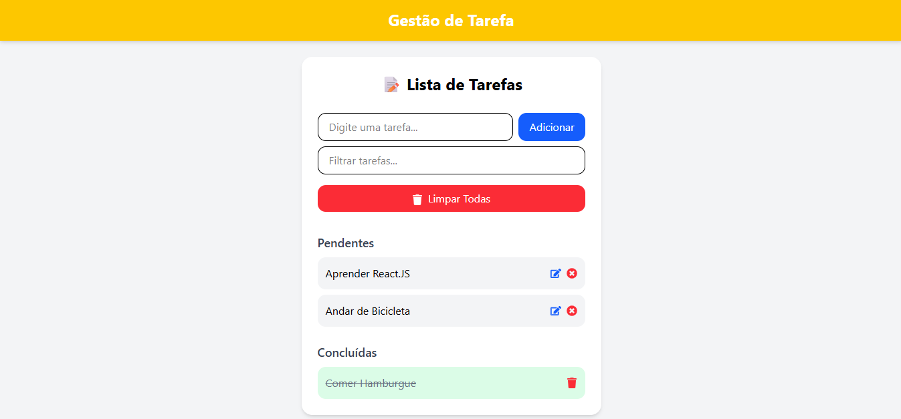

<h1 align="center">
     Gestão de Tarefas
</h1>
 <h2 align="center">
     Mini projecto To-do-list 
</h2>

 ## CRUD feito em React + Vite que consiste em:
 - adicionar novas tarefas
 - Atualizar tarefas
 - Eliminar tarefas
 - Filtrar tarefas
 - Mostrar tarefas concluídas e pendentes

### Tela do projecto

